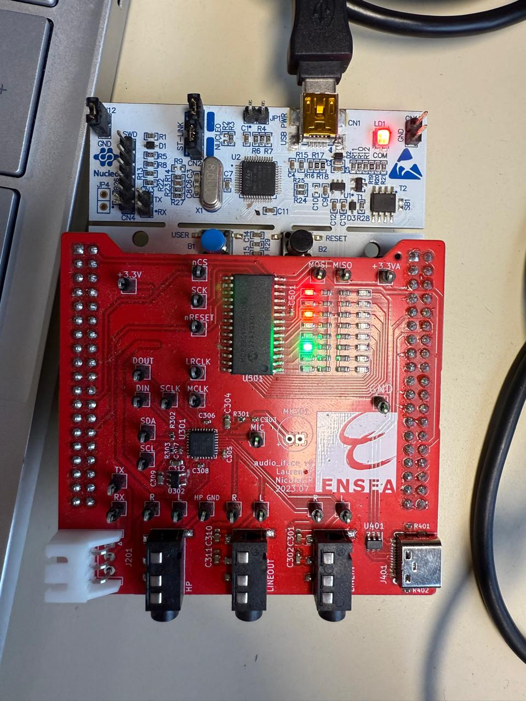
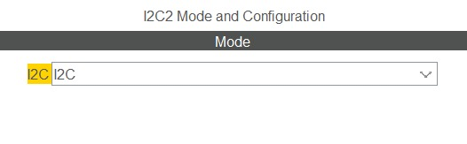
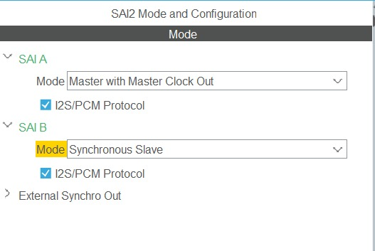
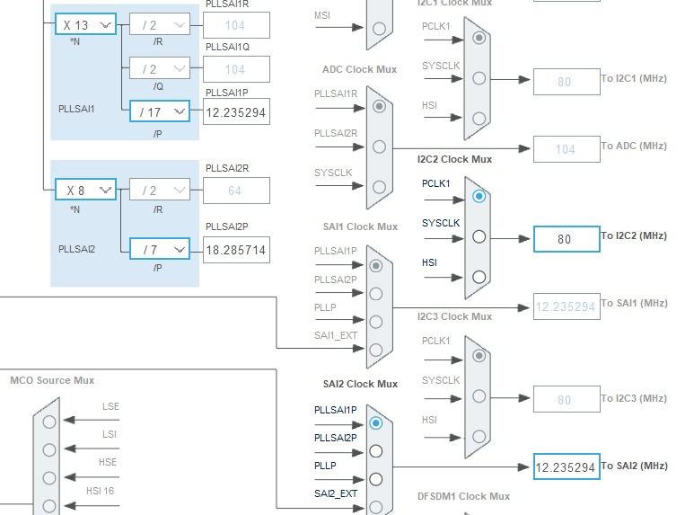
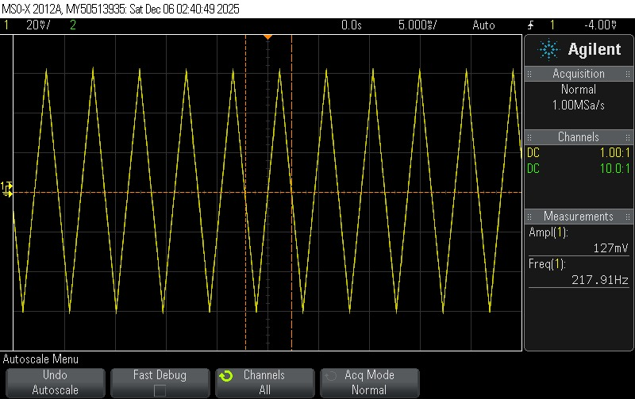

# TP de Synthèse – Autoradio  

##  Réalisé par:
- **AFIF Ikram**  
- **FAKHRI Menjli**

## Objectif du TP

L’objectif de ce TP est de configurer et d’exploiter différents périphériques de la carte STM32 NUCLEO-L476RG afin de construire un mini-système d’autoradio.
L’objectif final est d’acquérir une maîtrise de la configuration matérielle et de l’intégration logicielle dans un système embarqué complet.

---

# 1- Démarrage du projet

##  1.1 Création du projet (STM32CubeIDE)

Un projet a été généré pour la carte **NUCLEO-L476RG**, avec configuration de base et périphériques essentiels activés.  
Le BSP n’a pas été utilisé, conformément aux consignes.

##  1.2 Test de la LED LD2 (PA5)

Nous avons validé la configuration GPIO en effectuant un clignotement simple :

```c
HAL_GPIO_TogglePin(GPIOA, GPIO_PIN_5);
HAL_Delay(500);

```

##  1.3 Test UART2 

Pour tester la communication série entre la carte NUCLEO-L476RG et le PC via la STLink, nous avons envoyé régulièrement une chaîne de caractères sur l’USART2.
```
while (1)
{
    HAL_UART_Transmit(&huart2, (uint8_t*)"Hello\r\n", 7, HAL_MAX_DELAY);
    HAL_Delay(500);
}
```
##  1.4 Activation de printf

Pour permettre l’utilisation de `printf` via l’USART2, nous avons redirigé la sortie standard vers l’UART.
Ajout de la fonction suivante :
```
int __io_putchar(int chr)
{
    HAL_UART_Transmit(&huart2, (uint8_t*)&chr, 1, HAL_MAX_DELAY);
    return chr;
}
```
Test d’affichage :

```
printf("Test printf sur USART2 !\r\n");
```
L’affichage des messages dans le terminal série confirme le bon fonctionnement de l’USART2, comme présenté ci-dessous:


##  1.5 Activation FreeRTOS (CMSIS V1)
FreeRTOS a été activé depuis STM32CubeMX en utilisant l’interface **CMSIS V1**.  
Cette étape permet d’organiser l’application autour de plusieurs tâches gérées par l’ordonnanceur FreeRTOS.

Voici la configuration utilisée :


##  1.6 Mise en place d’un Shell fonctionnel
Un shell interactif a été ajouté afin de permettre l’envoi de commandes via le terminal (Tera Term).  
Ce shell fonctionne sur l’USART2 et permet d’exécuter différentes actions.

### 1.6.a Shell exécuté dans une tâche FreeRTOS

Dans un premier temps, le shell a été exécuté directement dans une tâche FreeRTOS dédiée.  
Cette approche permet au shell de tourner en continu, en lisant les caractères reçus sur l’USART2 via `shell_run()`.

La tâche a été créée avec la fonction `xTaskCreate` :


- **Fonctionnement de la tâche ShellTask**
 ```
void ShellTask(void *pvParameters)
{
    shell_init();

    shell_add('l', sh_led, "Toggle LED");
    shell_add('b', sh_blink, "Blink LED");

    shell_run();

    vTaskDelete(NULL);
}
```
- **Commande (Toggle LED)**
```
int sh_led(int argc, char **argv)
{
    int i;
    printf("toggle led\r\n");
    for (i = 0; i < 10; i++)
    {
        HAL_GPIO_TogglePin(GPIOA, GPIO_PIN_5);
        HAL_Delay(800);
    }
    return 0;
}
```
- **Commande (Blink LED)**
```
int sh_blink(int argc, char **argv)
{
    HAL_GPIO_WritePin(GPIOA, GPIO_PIN_5, 1);
    printf("Blink done\r\n");
    return 0;
}
```


- **Résultat obtenu dans Tera Term:**


### 1.6.b  – Fonctionnement du Shell en interruption + sémaphore FreeRTOS

Dans cette version, la réception UART ne se fait plus en mode bloquant, mais via une **interruption**.  
Chaque caractère reçu déclenche une **IT UART**, qui réveille la tâche du shell grâce à un **sémaphore binaire**.

Ce mécanisme nous permet d’éviter de bloquer la tâche, d’avoir une meilleure réactivité, et d’être compatible avec FreeRTOS.

- À chaque appel, la fonction déclenche une réception IT et attend le sémaphore :


- L’interruption donne le sémaphore pour réveiller la tâche Shell :


- Création du sémaphore + lancement de la tâche :
  


- Résultat sur Tera Term (réception OK via interruptions)


###  1.6.c  –Fonctionnement du Shell avec un driver
Dans cette version, le shell n’utilise plus directement les fonctions UART ni le sémaphore.  
Toutes les opérations d’entrée/sortie sont encapsulées dans une **structure driver**, ce qui rend le shell plus modulable et indépendant du matériel.

Le shell est maintenant contrôlé via les deux pointeurs de fonctions :
- `drv.receive` pour lire un caractère  
- `drv.transmit` pour envoyer une chaîne

- Initialisation du driver:


- Commande associée : fonction()
 Cette fonction envoie un message via le driver, sans utiliser printf :


- Résultat obtenu dans Tera Term
Le shell utilise bien le driver pour transmettre la réponse :


---

# 2- Le GPIO Expander et le VU-Metre

## 2.1 Configuration

## 2.1 Configuration du GPIO Expander

### 2.1.1 Référence du GPIO Expander
Le composant utilisé dans ce TP est le **MCP23S17**, un GPIO Expander fonctionnant en **SPI**.

### 2.1.2 SPI utilisé sur le STM32
Dans notre configuration, le STM32 utilise l’interface **SPI3** pour communiquer avec le MCP23S17.

### 2.1.3 Paramètres SPI à configurer dans STM32CubeIDE
Les paramètres essentiels du SPI3 sont les suivants :
- **Mode** : Full-Duplex Master  
- **Frame Format** : Motorola  
- **Data Size** : 8 bits  
- **First Bit** : MSB First  
- **Clock Prescaler** : 2 (40 Mbit/s)  
- **NSS** : Software ou Hardware Disable  
- **Polarity / Phase (CPOL/CPHA)** : par défaut  
- **GPIO associés** :
  - SCK → PC10  
  - MISO → PC11  
  - MOSI → PC12  
  - CS → Broche manuelle (VU_nRESET ici)
  - 
### 2.1.4 Configuration effectuée
Voici la capture de configuration utilisée :


## 2.2 Tests

### 2.2.1 Faire clignoter une ou plusieurs LED

Pour tester le fonctionnement du GPIO Expander (MCP23S17), nous avons commencé par allumer et éteindre une LED connectée au module via SPI.


### 2.2.2 Tester toutes les LED (chenillard)

Pour tester l’ensemble des sorties du GPIO Expander, nous avons implémenté un chenillard, c’est-à-dire une LED qui avance de bit en bit.


## 2.3 Driver

Dans cette partie, nous avons créé un **driver générique** permettant de contrôler les LED connectées au GPIO Expander **MCP23S17** via SPI.  
L'objectif est de séparer la logique applicative (shell) de la couche matérielle (SPI + MCP23S17).

### 2.3.1 Structure du driver

Le driver est implémenté à l’aide d’une structure contenant deux fonctions principales :
- écriture dans un registre du MCP23S17
- contrôle d’une LED (ON/OFF)

```c
typedef struct {
    void (*write)(uint8_t reg, uint8_t value);
    void (*set_pin)(char port, uint8_t pin, uint8_t state);
} led_driver_t;

led_driver_t drv_led;
```

### 2.3.1 Fonction shell pour allumer/éteindre n’importe quelle LED

Pour répondre à cette question, nous avons créé une fonction shell permettant de contrôler une LED le périphérique GPIO Expander MCP23S17 via une commande shell.

A 2 1 → LED A2 ON

A 1 0 → LED A1 OFF

**Résultat dans le terminal**


**Résultat sur la carte**



## 3. Le CODEC Audio SGTL5000
### 3.1 Configuration préalables

Le CODEC SGTL5000 nécessite deux protocoles pour fonctionner :
**I2C → configuration des registres internes du CODEC**
**I2S (via SAI2) → transfert des échantillons audio (lecture & écriture)**
Toutes ces configurations sont réalisées dans STM32CubeIDE / CubeMX.

**Configuration de l’I2C**
- Pins utilisées pour l’I2C

Sur notre carte STM32L476RG, l’I2C utilisé pour communiquer avec le CODEC passe par :
PB10 → I2C2_SCL et PB11 → I2C2_SDA



 **Configuration du SAI2 (I2S)**

Le CODEC audio utilise I2S, fourni par le périphérique SAI2 du STM32.
Configuration du SAI A



**Affectation des broches SAI**

Les broches doivent correspondre EXACTEMENT à celles du CODEC.

Signal SAI2	Broche STM32

FS_A	PB12

SCK_A	PB13

MCLK_A	PB14

SD_A	PB15

SD_B	PC12

 **Configuration de la Clock – PLLSAI1 = 12.235294 MHz**

Pour que le CODEC fonctionne, il doit recevoir une horloge MCLK précise.
Nous configurons donc PLLSAI1 pour générer : 12.235294 MHz pour SAI2




**Activation des interruptions**

Les interruptions du SAI sont ensuite activées pour gérer :

- La réception des samples audio
- L’envoi automatique via DMA


 
### 3.2 Configuration du CODEC SGTL5000 via I2C

Dans cette partie, nous vérifions la communication entre le STM32 et le CODEC audio SGTL5000 grâce au protocole I2C, ainsi que la présence de l’horloge MCLK indispensable au fonctionnement du CODEC.

#### 3.2.1 Vérification de l’horloge MCLK via oscilloscope

Le CODEC ne peut pas fonctionner sans une horloge fournie par le SAI2.

Nous avons mesuré MCLK à l’oscilloscope :


Résultat obtenu : ~12.26 MHz, conforme à la valeur attendue après configuration du PLLSAI.

#### 3.2.2 Lecture du registre CHIP_ID via I2C

Nous utilisons la fonction HAL_I2C_Mem_Read() pour lire le registre CHIP_ID (0x0000) du SGTL5000.

L’adresse I2C du CODEC est 0x14.

**Voici le code utilisé :**


**Résultat dans le terminal :**


#### 3.2.3 Observation des trames I2C à l’oscilloscope

Nous avons ensuite visualisé les trames I2C afin de confirmer :

- la présence du Start condition

- l’adresse du CODEC 0x14

- l’accès en mode lecture

- le retour des données sur SDA

**Trames I2C observées :**


#### 3.2.4 Lecture validée par l'enseignant

La communication I2C et la lecture du CHIP_ID ont été validées.

#### 3.2.5 Recherche des valeurs des registres dans la datasheet

Pour initialiser correctement le CODEC audio **SGTL5000**, nous devons configurer une série de registres essentiels au fonctionnement des blocs analogiques, numériques et de l’interface I2S.  
Les valeurs ci-dessous proviennent de la documentation constructeur.

| Registre               | Valeur  | Description |
|------------------------|---------|-------------|
| **CHIP_ANA_POWER**     | `0x6AFF` | Activation des blocs analogiques principaux |
| **CHIP_LINREG_CTRL**   | `0x006C` | Configuration du régulateur interne |
| **CHIP_REF_CTRL**      | `0x004E` | Réglage de la référence analogique |
| **CHIP_LINE_OUT_CTRL** | `0x0322` | Configuration des sorties ligne |
| **CHIP_SHORT_CTRL**    | `0x1106` | Protection contre les courts-circuits |
| **CHIP_ANA_CTRL**      | `0x0133` | Contrôle global des étages analogiques |
| **CHIP_DIG_POWER**     | `0x0073` | Activation des modules numériques (ADC, DAC, DAP…) |
| **CHIP_LINE_OUT_VOL**  | `0x0505` | Volume des sorties ligne |
| **CHIP_CLK_CTRL**      | `0x0002` | Configuration de l’horloge interne |
| **CHIP_I2S_CTRL**      | `0x0001` | Configuration de l’interface I2S |
| **CHIP_ADCDAC_CTRL**   | `0x000C` | Activation ADC/DAC et réglages associés |
| **CHIP_DAC_VOL**       | `0x3C3C` | Volume DAC (Left/Right) |

Ces valeurs seront appliquées dans l’initialisation du CODEC.

#### 3.2.6 Création des fichiers sgtl5000.c et sgtl5000.h

Deux fichiers ont été ajoutés afin de structurer le driver du CODEC :

```c
/Core/Src/sgtl5000.c
/Core/Inc/sgtl5000.h
```

#### 3.2.7 Fonction d’initialisation du CODEC

Dans sgtl5000.c, nous avons créé une fonction dédiée.

#### 3.2.8 Écriture des registres du CODEC via I2C

Résultat obtenu sur le terminal (preuve que chaque registre a été configuré correctement) :


L’initialisation se termine par : SGTL5000: Initialization complete, confirmant que le CODEC est bien configuré et opérationnel.

### 3.3 Signaux I2S

#### 3.3.1 Démarrage de la réception et transmission I2S avec DMA

Pour activer le flux audio du CODEC, nous avons commencé par créer deux buffers I2S :


Ces buffers permettent :

la réception des échantillons audio (sai_rx_buffer),

la transmission vers le DAC (sai_tx_buffer),

la mise en place du traitement temps réel.


#c
### 3.4 Génération de signal audio

L’objectif de cette section est de générer un **signal triangulaire** puis de l’observer à l’oscilloscope via la sortie audio du CODEC SGTL5000.

#### 3.4.1 Génération d’un signal triangulaire

Un buffer audio a été rempli avec une onde triangulaire simple.

#### 3.4.2 Vérification à l’oscilloscope

Un signal triangulaire stable a été observé sur la sortie LINE-OUT du CODEC.



### 3.5 Bypass numérique

L’objectif de cette partie est de réaliser un **bypass numérique** : les échantillons provenant de l’ADC du SGTL5000 sont récupérés via l’interface I2S, puis immédiatement renvoyés vers le DAC sans aucun traitement.  
Le signal d’entrée (LINE-IN) doit ainsi ressortir directement sur la sortie audio.

#### 3.5.1 Implémentation du bypass

Le STM32 reçoit les données audio via le DMA du SAI2 Block B (RX).  
À chaque interruption (`HalfCplt` et `Cplt`), les échantillons reçus sont copiés dans le buffer de transmission du SAI2 Block A (TX).

Le code suivant réalise la copie directe RX → TX :


#### 3.5.2 Vérification à l’oscilloscope

L’oscilloscope montre que la forme d’onde en sortie du CODEC est identique à celle appliquée en entrée LINE-IN.
Le bypass numérique fonctionne correctement : aucune distorsion ni délai perceptible n’a été observé.


